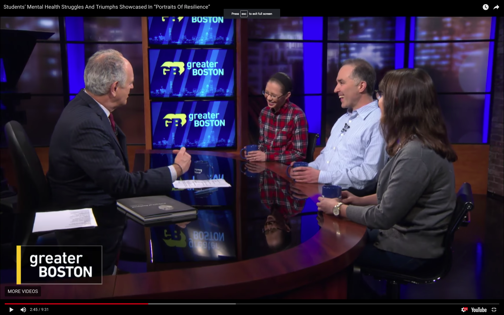

A wonderful experience being [interviewed](https://www.wgbh.org/news/education/2018/05/14/students-mental-health-struggles-and-triumphs-showcased-in-portraits-of-resilience) with Haley and Cat by Jim Braude on WGBH TV’s Greater Boston. Here’s the moment just after Haley called Jim “sir” and he reacted with astonishment.

