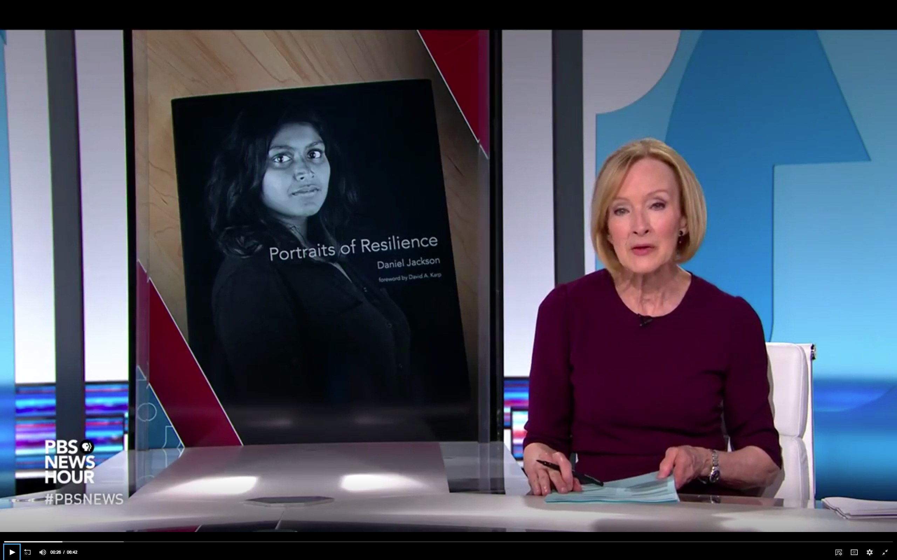

An incredibly exciting day: the team from Newshour visited us at MIT. Here is Jeff Brown interviewing Haley, Victor and Emily in an MIT classroom with producer Anne Davenport looking on. Amazingly, Newshour gave us two segments. You can watch them [here](https://www.pbs.org/newshour/show/portraits-of-resilience-destigmatize-depression-at-one-of-the-worlds-top-universities) and [here](https://www.pbs.org/newshour/show/how-students-who-struggle-with-mental-illness-can-find-help).

