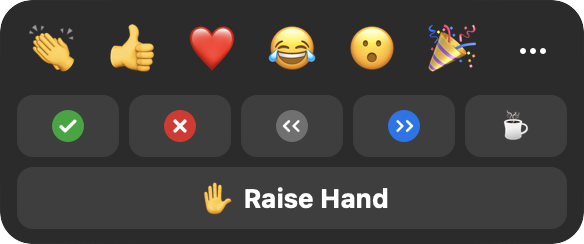
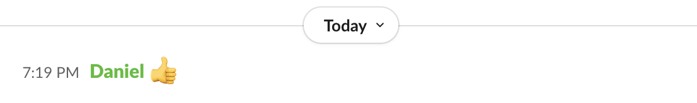
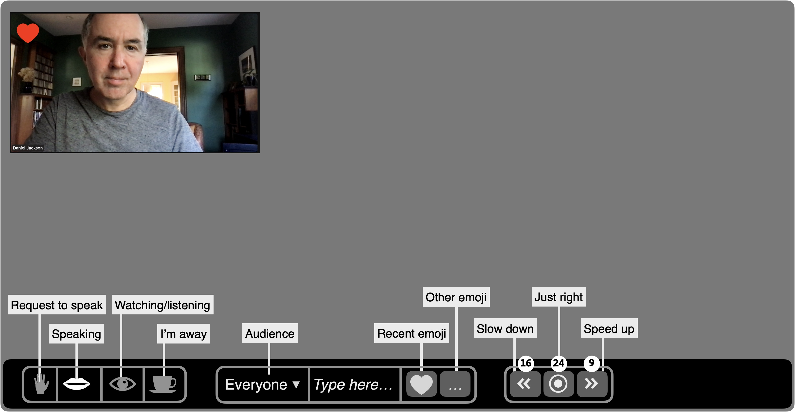

In an old interview, unfortunately no longer online, Jony Ive explained how his team at Apple had designed the MacBook's rounded corners. "I suppose that's pretty obsessive, isn't it?" he ended, with a self-deprecating smile.

It struck me as a perfect metaphor for software design: that so often the real work is in the smoothing of rough edges. Each small protrusion and snag may seem inconsequential by itself, but in aggregate they create a constant stream of irritation and confusion for the user. Focusing on them may seem obsessive, but the result can be dramatic. As the Eames told us, the details are not the details: they _are_ the design.

Concept design offers a new way to control irregularities, the rough edges of software. In this post, using Zoom as an example, I'll explain some simple tactics for identifying and then eliminating them.

## Zoom's Reaction Concept
When analyzing an existing application, its concepts may not be readily apparent. In a well-designed app, the concepts will be _mapped_ directly to user interface elements, but this is not always so (especially for subtle concepts). Nevertheless, when evaluating an app, it makes sense to start by assuming that the key concepts are aligned with the primary features as they present themselves to users.

So we'll assume for now that the prominent button labeled _Reactions_ corresponds to a concept, and we'll treat it as such for now. 

Notice that there are three rows of buttons: (a) the top row, comprising emojis such as clapping, thumbs up, etc; (b) the middle row with yes and no buttons, left and right arrows, and a coffee cup; and (c) the bottom row with a single "raise hand" button.

## Irregularities in Reactions

Clicking on any button, in any row, causes the corresponding icon to appear, as you'd expect. It actually appears in multiple places in the user interface, most prominently in the top-left-hand corner of your box in the meeting grid.

What might not be so obvious is that the different buttons behave in slightly different ways.

First, there's a disappearing effect on some reactions but not others. Clicking on a button on the top row makes the emoji appear, but then disappear automatically after ten seconds; this doesn't happen with the reactions on the other rows.

Second, some have an undo action. Clicking any button also produces a small icon above the Reactions dialog; for all but the emojis, these icons turn out to be buttons you can click to turn off the effect.

Third, the buttons enforce some disjointness rules. The top row buttons operate as a radio button group; clicking any one replaces another (if it hasn't yet disappeared). Likewise, the middle row is a group. Surprisingly, the Raise Hand button in the bottom row belongs to this group: if you've clicked the check mark, for example, clicking the Raise Hand button will make it go away.

## In Search of Purposes
Having identified these irregularities, our next step is to try and justify them—essentially reverse engineering the designer's rationale.

Let's think about purposes. The Reactions concept as a whole has a simple purpose: to allow users to convey certain common feelings in a lightweight fashion. Digging more deeply, though, we can identify different sub purposes with each row. 

The top row lets users convey emotions, presumably in reaction to something said or shown by someone else. For the middle row, it's hard to find a single subpurpose. The yes/no buttons are for responding to questions from the speaker; the arrow buttons are to suggest that the speaker slow down or speed up; and the coffee cup button indicates that the user is away from the meeting. The Raise Hand button signals a desire to speak.

With these more refined purposes, we can now consider the irregularities and see if they make sense.

The disjointness idea is plausible: for example, you wouldn't want to tell a speaker to slow down and speed up at the same time. The automatic disappearance is reasonable, too: clapping, for example, is a momentary gesture and it might be annoying to have to turn it off.

But when we examine these more closely, we see that there are some problems. It makes sense that speed up and slow down are disjoint, and that laughing and crying are too. But why can't you clap and send a heart at the  same time? And why does stepping away make your yes/no response disappear? And raising your hand cancel your request that the speaker slow down or speed up?

We can summarize the irregularities we've found in two tables. First, a table of the features of each reaction type, with a check mark showing that a feature is present, and a red checkmark in parens showing that it is present but probably shouldn't be:

| Reaction | Disappears | Counted | Cancel by host
| -------- | ----- |----- |----- |
| Emojis | ✔︎ | (✔︎)| |
| Yes/no |  |✔︎|✔︎|
| Slow/speed | |✔︎|✔︎|
| Away | |(✔︎)|(✔︎)|
| Hand | |(✔︎)|✔︎|

(Counted refers to whether a count is displayed for the reaction in the participants panel; cancel by host refers to that panel's "clear all feedback" action. Both are discussed later.)

And a table showing disjointness between reaction types:

| Reaction | Emojis | Yes/no | Slow/speed | Away | Hand
| -------- | ----- |----- |----- |----- |----- |
| Emojis |✔︎|  |  |  |  |
| Yes/no | | ✔︎| (✔︎)|(✔︎)|(✔︎)|
| Slow/speed | | (✔︎)| ✔︎| (✔︎)| (✔︎)|
| Away | | (✔︎)| (✔︎)| ✔︎| (✔︎)|
| Hand | | (✔︎)| (✔︎)| (✔︎)| ✔︎|

The large number of red marks in these tables suggests we have work to do!

## Fixing Irregularities
The complicated differences between reactions are no doubt intended to save the user trouble (so you don't need to unclap your hands, for example, or turn off slow down when you want the speaker to speed up). But like any automation, they come at the expense of reduced flexibility.

In some cases, the flexibility is minor: being able to send more than one emoji at a time, for example. But in others, it's more significant. I can't imagine  that any speaker really wants the yes/no responses to a question to disappear when participants raise their hands.

This suggests a concept design that lets the developer adjust the rules over time. Rather than hardwiring the fact that claps disappear but yes/no answers don't, we could design the Reaction concept with an action  _makeDisappearing (reaction)_, which, when executed, causes a particular reaction to become a disappearing one. In a preamble in the code, a series of calls can then configure the reactions to be disappearing or not. 

A similar strategy can be applied to disjointness: an action _addToGroup (reaction, group)_ might add a reaction to a radio button group with the effect that all reactions in the group are mutually disjoint.

With this richer concept in hand, it would be easy to fix the problems in Zoom. We can assign the yes and no reactions to one group, and the slow down and speed up reactions to another.

Note also that a concept that has been parameterized in this way is properly generic. Our Reaction concept need know nothing about emoji or yes/no answers; it simply has a generic notion of reactions. Keeping a concept generic saves us from introducing domain-specific behaviors, and thinking about using the concept in other contexts helps us evaluate its plausibility.

(It would be interesting to know if the  design of Zoom already incorporates this more flexible concept, or if the programmers have instead hardwired a collection of behaviors—which might explain why what seem to be some undesirable cases have not been fixed. It also seems that these irregularities have changed between versions. When the disappearing behavior was introduced, it applied to the second row of reactions too, leading one frustrated teacher to [recommend](https://www.youtube.com/watch?v=wHksgw9lqRo) that you use the raise hand reaction for counting responses to a question instead!

More controversially, we could expose these configuring actions to users, letting each user decide what behavior they want: for example, whether they want to be allowed to display multiple emojis at once.

Another possibility is to simply eliminate the irregularities. We could design the Reaction concept with two distinct actions: _toggleReaction (reaction)_, which turns a reaction on or off;
and _transientReaction (reaction)_, which shows a reaction for ten seconds or extends it for ten further seconds if it's already showing. One could map these actions to the user interface in various ways: a double-click might be a _toggleReaction_ and a single-click a _transientReaction_, for example.

Of course, such a design introduces its own complications. I'm not recommending it, but just illustrating the range of possibilities.

## Doubling Down: Expanding Differences

When you encounter an irregularity in a design, one response is to try and minimize it or even eliminate it. But the opposite may be plausible too: to actually expand the irregularity. If differences are justified by purposes, then distinct purposes may call for amplifying differences amongst the functions that fulfill them.

Having noticed that the reactions behave differently, we identified at least two different subpurposes: sending emotional reactions (clapping, smiley faces, etc) and providing feedback (slow down, speed up, etc). One difference between these is that reactions in the first class disappear automatically. 

Recognizing these distinct subpurposes, we might now wonder whether they suggest additional differences in behavior.

First, we might consider differences of audience: perhaps feedback should be shown only to the speaker; a student in a class might not want to share with all the other students a request that the lecturer slow down (and might want to be anonymous to the lecturer too). And perhaps users would like to select the targets of their emojis, sending a heart to just one favored participant, say. 

Second, noticing that the participant window shows counts for reactions:

we might decide to only count some kinds of reaction. Counting how many participants replied yes vs. no, or how many said speed up vs. slow down makes sense. But do we need a count of the number of participants who have sent hearts?

Third, we might consider differences in interactions with other concepts. Perhaps emotional reactions should be included in the chat window, for example, the way they are in Slack:

Readers familiar with concept design will detect a bad smell in this discussion. Expanding irregularities amongst reactions will make the overall Reaction concept more complicated and fragile. To keep it generic, we'll now have to have classes of reactions that are counted and classes that are not; and classes that can have targets of particular users; and classes of reactions that are reported in the chat.

These irregularities have arisen because a single concept is now serving multiple purposes—and those purposes are to some degree in conflict with each other. This is what I call _overloading_, and it suggests that we should consider splitting Reaction into multiple concepts.

## Even Larger Differences: Concept Splitting

Once the possibility of concept splitting comes up, we start to see opportunities for even larger differences between the reactions (and we'll be reaching the point where it will no longer make sense to even talk of them as "reactions" as if they were a uniform set with a single purpose).

The Raise Hand function, for example, seems to be in a different category from the others, because of the role it plays in negotiating who's speaking. People often forget to lower their hands, making us wonder if a concept is called for that manages the queue of requests to speak, letting a moderator select the next speaker and automatically lower their hand.

The emoji reactions might be absorbed in a more conventional reaction concept associated with the chat window: sending emojis could still be easily accessible via buttons on the toolbar, but these might be shortcuts for emoji messages that are similar to other messages in a chat, but just shorter.

We've gone full circle in a sense, here: we accepted the irregularity of emoji reactions (as distinct from yes/no, for example), and even embraced it. Now we're proposing moving the emoji functionality out of the Reaction concept into another concept. But recognizing that the Chat concept might be the right place for it, we're ending up having actually eliminated the irregularity! We might retain the distinction that emojis, unlike regular text messages, show in a user's box in the meeting grid. Even this might be worth reconsidering, however. Maybe chat messages could be displayed there too; I could imagine asking a small class to post a brief response to a question, and preferring to see those responses next to the faces of my students rather than in the chat window.

Likewise, the "I'm away" button suggests a concept in its own right. It brings to mind the concept of Presence in social media apps such as Slack, in which a user can indicate their availability and readiness to participate.

As to the yes/no, slow down/speed up buttons: they too suggest a separate Feedback concept. The Feedback concept is what you might call a _fledgling concept_ in Zoom. It's not quite there, but there are hints in various places that the developers have such a concept in mind. There is a "clear all feedback" action in the Participants window; unfortunately, the word "feedback" does not appear in the Reaction window so it will be unclear to most users that it refers to all but the first row of reactions. And it's strange that "I'm away" and a raised hand are treated as feedback, so when this action is executed, those flags disappear too.

One might also wonder whether the yes/no buttons are intended to provide a kind of ad hoc poll. If so, perhaps they should be integrated into Zoom's Poll concept. This concept is rather heavyweight: you have to create questions in advance, give a title to the poll as a whole, and only multiple-choice (and not yes/no) questions are supported.

## A User Interface Mockup
Our concept analysis of the Reaction concept has led us to a realization that there are actually multiple concepts behind this one dialog. Ideally, concepts are mapped directly to the user interface. Here's a mockup of how things might look, with tooltips showing all at once:

The raise-hand and coffee-cup reactions have been moved into a Presence concept (far left) with which the user indicates their participation (requesting to speak, speaking, watching/listening or away). The audio   and video settings might be set implicitly: when you switch to speaking, for example, your audio is unmuted. This might address the common problem that users often start speaking without unmuting. Also, some (like me!) are anxious in a large meeting that they might have their audio on inadvertently, so having an explicit indicator that you're not speaking may help. Less common settings (eg, speaking with video off, or speaking with video on and audio off for an ASL presenter) could be available in a submenu.

The emoji reactions have been moved into the Chat concept, which is now directly accessible on the toolbar. And the slow down/speed up reactions are now in a Feedback concept of their own, along with visible counts. These controls might appear only when a host activates them. 

Of course, this is all speculative, and this design undoubtedly has flaws yet to be discovered. My intent in showing this mockup is not to claim that it would necessarily work better than Zoom's current arrangement, but simply to show the way in which concept analysis can drive user interface design.

## Summary of principles
The approach I've described here is guided by a few basic principles:
1. Irregularities, or differences between similar features, usually impose a cognitive burden, because there's more to understand than when things behave the same way. Simplicity therefore suggests eliminating irregularities and a preference for uniformity.
2. An irregularity may, however, serve a legitimate purpose, and its value may exceed the cost. So any evaluation of irregularities must make purposes explicit.
3. For each irregularity, then, we must determine whether it is justified (and should be tolerated) or not (and should be eliminated). If justified, we should ask whether the irregularity is _sufficient_ to support the purpose that motivates it, or should even be _extended_.
4. A concept can accommodate a certain amount of irregularity in its design, but the irregularity can be organized in a systematic and generic way. 
5. Once purposes diverge significantly, it is better to split into multiple concepts for each of the variant forms of behavior, rather than attempting to contain them within a single concept. Paradoxically, this final extension of differences typically reduces irregularities, because each concept is now more regular. If the new concepts already exist in the app, or are familiar from other apps, the perceived gain in simplicity is even greater.

## Summary of tactics
The process I've outlined here is summarized in the diagram below:

The process may be executed as a routine design review, applied to each concept in turn. Alternatively, it may be prompted by a misfit that is observed (to use Christopher Alexander's term). In my case, the misfit was the common experience of participants in meetings forgetting to lower their hands after they spoke, which led me to take a closer look at Zoom's Reaction concept.

Once the relevant concepts have been identified, we look for irregularities. For each irregularity, we try to find either a justification (eg, that emoji, unlike raised hands, are transient gestures so it makes sense that they should disappear spontaneously), or a problematic scenario (for example, a lecturer losing track of yes/no answers because raised hands clear them). These lead to a classification of which irregularities should be retained and which should be eliminated. 

The next phase involves a design intervention: refining the concept at hand (eg, defining configurable disjointness rules for reactions), splitting into multiple concepts (eg, factoring out the raised hand reaction into a Moderation concept), or merging some functionality into an existing concept (eg, moving emoji into Chat).

The outcome of the phase is a modified design. Hopefully it's an improvement, but we might have introduced new problems, or failed to solve the initial misfit. Some evaluation is called for, whether by user studies, design review or some combination. As with any design process, some iteration is inevitable.

## How Concepts Help

The basic idea of identifying and eliminating irregularities is not specific to concept design. But concepts help in some key respects:
1. The task of reviewing a design for irregularities is eased by considering one concept at a time.
2. Concept design's focus on motivating purposes helps us clarify which irregularities are justified and which are not.
3. Concepts give modular boundaries within which to add new functionality (such as the _addToGroup_ configuring action).
4. Concepts help structure refactorings in which functionality is moved (eg, emojis becoming part of the Chat concept).

## An Invitation

I'm sure many of my readers have conducted analyses similar to the one I describe here. If you have one you can share, please post it in the [concept forum](http://forum.softwareconcepts.io). And as always, comments, criticisms and reactions (!) welcome.

## A Concept Integrity Violation
You may wonder why I included parens around the red checkmarks in the tables. Winter Ferguson [pointed out](https://forum.softwareconcepts.io/t/concept-design-tutorials/129/2) that those checkmarks appear uncolored on Android phones. Android automatically converts text characters to corresponding emoji, on which CSS colors are then ineffective. This is a nice example of a concept integrity violation and is a [known problem](https://stackoverflow.com/questions/32915485/how-to-prevent-unicode-characters-from-rendering-as-emoji-in-html-from-javascrip).