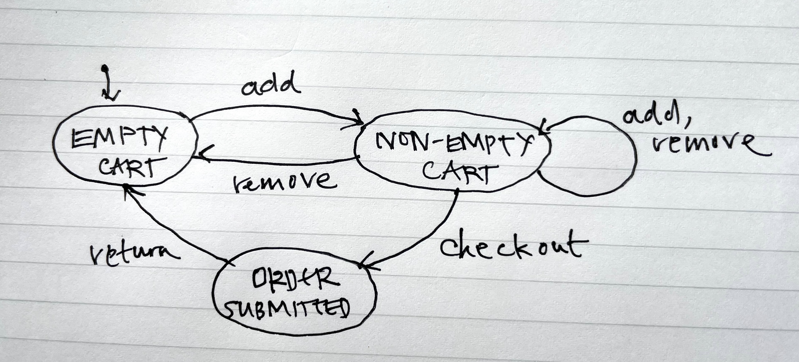
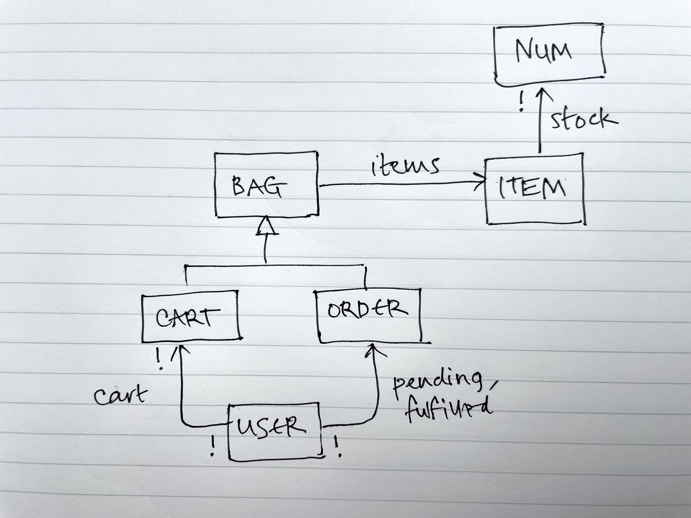

If user experience runs [deeper](../../design-general/beyond-ui) than the user interface, we need a way to talk about an app that isn’t just visual, and that captures behavior in a more fundamental way.

Programmers think in terms of complicated things like objects, callbacks, streams, functionals, and so on. They’re essential for structuring code, but for behavior a much simpler model is effective.

## State machines

That model is the **state machine**. You’ve probably come across state machines, either in a class about the theory of computation, or seeing diagrams like this:

This diagram describes the state machine of a shopping cart. You start with an empty cart; adding an item produces a non-empty cart; then you can add and remove more items; checkout; and then return to the initial state.

Diagrams like this are useful for capturing basic control flow. But they’re not rich enough for modeling behavior, because the number of states must be finite (and small enough to draw!). This diagram doesn’t say that the order you submit when you checkout contains the items you added and didn’t remove. And because individual items aren’t tracked, it needs some non-determinism to model the fact that when you remove an item from a non-empty cart you might end up back with an empty cart (if it was the last item) or you might not (if it wasn’t).

A richer state machine model has a set of states, usually infinite, and a set of parameterized actions over the states. The states can be defined with some variables whose values are either primitives (such as integers and strings) or more often structures (such as sets and relations).

## States

The variables representing the state of an online store, for example, might include one holding the number of each item in stock:

	stock: Item -> one Number

sets of pending and fulfilled orders for each user:

	pending, fulfilled: User -> set Order
	
a shopping cart for each user:

	cart: User -> one Cart

and, for each cart or order, the items it contains:

	items: (Cart + Order) -> set Item
	
The value of each of these variables is a *relation*. The *fulfilled* variable, for example, is a set of pairs of the form *(u, o)* where *u* is a user and *o* is one of *u*’s fulfilled orders. Viewed as a table, there’s a separate row for each user and order. So if there are two fulfilled orders for Alice  and one for Bob, the table might look like this:

| User | Order |
| ----- | ----- |
| Alice | Order\_1 |
| Alice | Order\_3 |
| Bob | Order\_2 |

## Actions

The actions read and write these states. Here’s an action for adding an item to a cart:

	add (c: Cart, i: Item)
	  i.stock > 0
	  c.items += i
	  i.stock -= 1

The first line says the item has to be in stock; the second adds the item to the card; and the third reduces the stock of that item by one. An occurrence of an action is defined by an action name and some parameters. You can imagine drawing an infinite state machine diagram, but instead of labels like *add* (as above) we have labels like *add (Cart\_0, Item\_1)*.

Removing an item from a cart looks like this:

	remove (c: Cart, i: Item)
		i in c.items
		c.items -= i
		i.stock += 1

When you checkout, a fresh order is created and made pending, the cart is deleted from the user’s carts, and the order is given the set of items that were in the cart:

	checkout (u: User, c: Cart, o: Order)
		fresh o
		u.pending += o
		c in u.carts
		u.carts -= c
		o.items := c.items

Finally, when an order gets fulfilled, it’s moved from the set of pending orders to the set of fulfilled orders:

	fulfill (u: User, o: Order)
		o in u.pending
		u.pending -= o
		u.fulfilled += o

## ER diagrams

An ER diagram offers a nice way to show the state variables:

There are a few differences from the textual declarations. I’ve used symbols rather than words for multiplicity (*!* in place of *one*, for example). I’ve shown the multiplicity on both ends of a relation: the *!* on the source end of the cart arrow says that each cart belongs to one user. You can do both of these textually too. The diagram doesn’t naturally accommodate unions of sets, so for the items relation I introduced a superset called *Bag*, with each *Bag* being either a *Cart* of an *Order*.

These diagrams are very lightweight and contain lots of information. Working out the details of the state as you the draw the diagram always reveals interesting questions. Can a user have more than one cart, for example? That’s certainly possible for Amazon, because a client-side cart is created before you even log in.

## What’s the point?

1. **UI-independent view**. Viewing an app in terms of its state and actions lets you think about its behavior concretely, but without having to consider the details of the user interface. And when you come to design the UI, you can ask yourself how to *map* the states and actions to UI views and widgets.
2. **More succinct than use cases**. A use case can be useful for describing the details of a workflow, but often a single action will suffice. The *checkout* action, for example, could encompass all the steps in checking out a shopping cart, and the flow would be better described using wireframes than text. For capturing a fuller journey (that a user adds and removes items from a cart, then checks it out, then the order is fulfilled), I recommend using an [operational principle](../operational-principle) written in terms of actions.
3. **Path to implementation**. It’s easy to extract a relational database schema from the ER diagram. [OMT](https://en.wikipedia.org/wiki/Object-modeling_technique) showed how to do this systematically. You can also generate a class hierarchy for an object-oriented approach.
4. **Small details expose big issues**. The biggest advantage of writing down a state machine is that as you work out small details you inevitably encounter questions that expose serious design issues. For example, when I wrote the *add* action, I had to decide whether it should check the *stock* of the item, and if so, whether it should decrement it. I decided to do both, which means that (a) you can only add an item that is in stock; and (b) you’re assured that when you checkout, the item you wanted won’t have been taken by someone else. But this convenience for the user comes at a cost for the company, because it means that items will be shown as unavailable when they haven’t yet been paid for. And there will need to be a way to return an item to the inventory if too much time elapses with the cart not being checked out.

## Some technical notes
- **History**. This kind of state machine model was introduced by the Z Notation in the late 1970s, and became universal in all formal modeling languages (VDM, B, TLA and my own language Alloy).
- **Global state**. The state represents the entire global state of the app, frontend and backend. A state machine can describe a distributed system too. Butler Lampson shows how to do this in his [course notes](http://butler.lampsons.us/48-POCScourse/48-POCS2006Abstract.html) on operating system design.
- **Notational nitpicks**. The notation I used in the example is mostly from Alloy, with a shorthand for updating a relation. The statement *c.items -= i* would be written *c.items’ = c.items + i* in Alloy. There’s a crafty overloading going on in the treatment of the inventory counting: since the stock variable maps each item to exactly one number, I’ve written *i.stock += 1* for *i.stock’ = plus(i.stock, 1)*, with the *+* meaning integer additional and not the set union it usually means in Alloy.
- **Visible state**. In many formal methods, the state is assumed to be hidden, and the user’s view of the state is represented by observer actions that produce outputs but don’t update the state. It’s easier to just assume that the state is by default visible to the user, and to describe how and when the user can view the state as part of the user interface mapping.
- **Relations and RDBs**. Relations don’t need to be binary. But relations of higher-arity should only be used when there’s a genuine need to relate more than two things: in RDB terms, the relations should be fully *normalized*. For example, to allow more than one of a given item in a cart or order, we could declare a 3-place relation containing the tuple *(c, i, n)* when cart *c* has *n* copies of item *i*:

		items: (Cart + Order) -> Item -> one Number
- **Output actions**. Actions can be inputs (initiated by a user) or outputs (initiated by the system). An input action can have output parameters as well as input parameters.
- **Determinism**. I prefer all actions to be deterministic. This doesn’t actually prevent the system from making choices that aren’t controlled by the user; it just means that those choices must be exposed in action parameters. For example, an airline reservation system might assign a seat to a passenger with an action whose signature is

		assignSeat (p: Passenger, out s: Seat)