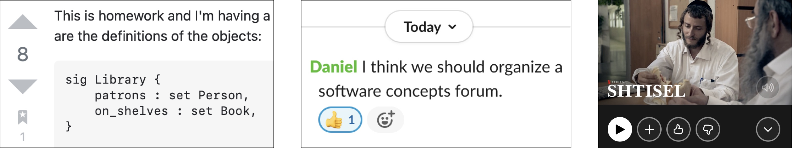

In the 1980s, there was a revolution in software. The Apple Macintosh came out (building on the invention  of the WIMP interface at [PARC](https://en.wikipedia.org/wiki/Xerox_Alto)), Don Norman wrote [*The Design of Everyday Things*](https://en.wikipedia.org/wiki/The_Design_of_Everyday_Things), and the first [CHI conference](https://sigchi.org/conferences/conference-history/) was held.

Now everyone knows how important user interface design is, and there’s no excuse for messing it up.  You can find several collections of UI design heuristics (such as [Nielsen’s](https://www.nngroup.com/articles/ten-usability-heuristics/)) online, and many companies publish standards for how to use UI widgets consistently (here’s [Google’s](https://material.io/design), for example).

The downside of all this success is that people sometimes forget that UI design is only part of [software design](../design-vs-engineering). A good user interface is necessary for a good user experience but it’s not sufficient. Just as important—maybe more important—is the underlying functionality, defined by the concepts that the software provides.

In my book, I open with a story about Dropbox. Its UI design is state of the art, but people still get confused and end up deleting other people’s files. The reason, I explain, is that the underling conceptual model is confusing.

To see how UX is more than the UI, consider three widgets that let the user do a thumbs-up on something:

From a UI perspective, these look pretty similar. In each case, you click on some kind of “up” button to signal that you like something.

But behind this apparent similarity in the UI, there are actually three completely different concepts, which a user must grasp to make sense of these buttons.

In the first, on the left, the arrow-up action is part of an Upvote concept in StackOverflow: clicking it says you approve of the answer (or the question). The accumulation of clicks gives a crowd-sourced measure of the credibility of items, affecting the order in which they appear.

In the second, the thumbs-up action is part of the Reaction concept of Slack, and is just a kind of minimal message sent back to the author of a post. It has no effect on the order in which posts appear.

In the third, the thumbs-up action is part of the Recommendation concept in Netflix, and is used when you liked a movie that you saw. Your approval isn’t shared with other users, and it doesn’t affect the rank of this particular movie. What it does is indicate that you want to see more movies similar to this one.

The design considerations in these three examples are all very different, and each has subtleties and problems of its own. One example: a friend told me that she saw a movie that she thought was really sexist, so she didn’t want to give it a thumbs up, but she liked the genre so she wondered if she should anyway.