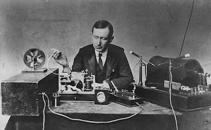
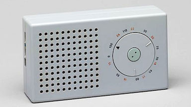

## Defining design
What's a good working definition of the word *design* and how it differs from *engineering*? For those of us who care about design, this is an important question, because it helps explain what we do, and why it matters.

Herb Simon said “To design is to devise courses of action aimed at changing existing situations into preferred ones.” This definition nicely highlights the design aspect of Simon’s own focus on decision making in organizations. But it’s too broad to help us understand what “software design” might be.

## Kapor’s definition of design

For that, I turn to Mitchell Kapor who [defined design](https://hci.stanford.edu/publications/bds/1-kapor.html) like this:

*It’s where you stand with a foot in two worlds—the world of technology and the world of people and human purposes—and you try to bring the two together.* 

Kapor gives building design as an example. It’s the architect who designs the building and shapes the experience of its occupants. The engineer makes sure the building won’t corrode or sway in the wind, concerns that are critical but don’t require an understanding of people.

In just the same way, software development involves two very different kinds of activity: *designing* the functionality that shapes the user’s experience and *engineering* the system to support it.

## Design is not just visual

Just because software design involves people doesn’t mean that it’s only about the user interface (or more narrowly its visual appearance), or that it’s mostly about psychology and how people feel.

The focus of software design is devising and structuring behavior. Doing this well requires deep technical understanding. Just as the architect of a building has to understand not only how people experience spaces, but also what kinds of spaces can be built, so a software designer has to understand how people experience functionality and what kinds of functionality software can support.

## The design/engineering spectrum

You can sometimes do without an engineer (creating a poster or a teacup, for example) and sometimes without a designer (building a memory allocator or an integrated circuit).

But for most artifacts, including software, design and engineering are needed in equal measure.

And sometimes one or other is needed when you might not expect it. The “screwpull” wine opener is not just a design product; it relies on the engineering of a Teflon coating that  is slippery enough for the spiral not to get stuck in the cork.

You might think home routers and wireless access points would use designers only for making pretty boxes. But setting up a wireless network turned out to be more complicated and error-prone than most engineers imagined, and devices like Amazon’s Eero and Google’s Nest   are distinguished from their competitors not by their bandwidth but by their ease of setup.

Whether design or engineering matters more may depend on whether a technology already exists, so it changes over time. Marconi’s first radio was an engineering achievement, but Dieter Rams’s radio was a design product.

## Where design differs
Because design, unlike engineering, focuses on the meeting point between people and products, some big differences in practice emerge:

1. **Misfits**. In engineering, the context of usage is more clearly understood. In design, the context invariably brings surprises, and failures are usually not because specifications aren’t met but because the specifications themselves were wrong. See [Misfits](../misfits).
2. **Role of specs**. In engineering, the problem statement is a specification. In design, the problem is harder to characterize and finding specs of desirable behavior is the output, not the input of the design process.
3. **Qualitative vs. quantitative**. In engineering, criteria can often be expressed numerically: a storage device has capacity, latency, bandwidth etc. In design, the criteria are usually more nebulous, if known at all.

Nevertheless, design and engineering activities have much in common. Perhaps most importantly (and often neglected) is the role of patterns and prior knowledge. New creations never come out of thin air, but are always adaptations and extensions of earlier ones.
