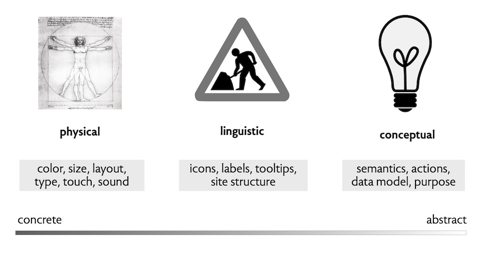

When you’re diagnosing a usability snag, or coming up with a new design idea, it’s helpful to know what _level_ you’re working at.

Over the years, designers and researchers have defined various levels, reflecting their view of design and what they emphasize.

I find the following scheme most helpful:
1. **Physical**. If you want to think of levels as low and high, this one is at the bottom. It’s the level of design in which you’re concerned about the physical (and physiological) qualities of human users. So it might involve physical things (like picking colors), but it includes less tangible aspects too (such as how long an action can take before you need to show a progress bar).  To do this kind of design, you need to know a bit about human anatomy and physiology. For example, Fitts’s Law tells you how long it takes to move a pointing device to its target; perceptual fusion tells you that a delay of more than 10ms will be perceptible; and the fact that 1 in 12 males is red-green colorblind says you’d better not rely on those colors for important distinctions.
2. **Linguistic**. This level involves design around language, and how you can use icons and words to convey information to users. Unlike the physical level, this level is culturally dependent: a [white circle with a red border](https://en.wikipedia.org/wiki/Prohibitory_traffic_sign) means no entry to Europeans, but not to Americans. One of the most important design heuristics is to use linguistic cues consistently within your app and across apps.
3. **Conceptual**. This level is about the semantics of an app: its behavior, given by the actions you can perform and the state the actions read and write, and the meaning and implications of those actions and state.

Here’s a picture illustrating these levels. The illustration for the linguistic level is a British road sign affectionately known as “man having trouble opening umbrella.”

Beyond the conceptual, there’s another level that is significant but less often considered explicitly by designers. We might call it the **social** level, and its about the impacts that your app has on society. In the design of a social media app, for example, you’d want to make sure you don’t encourage addiction and damage the self-esteem of teenagers.

