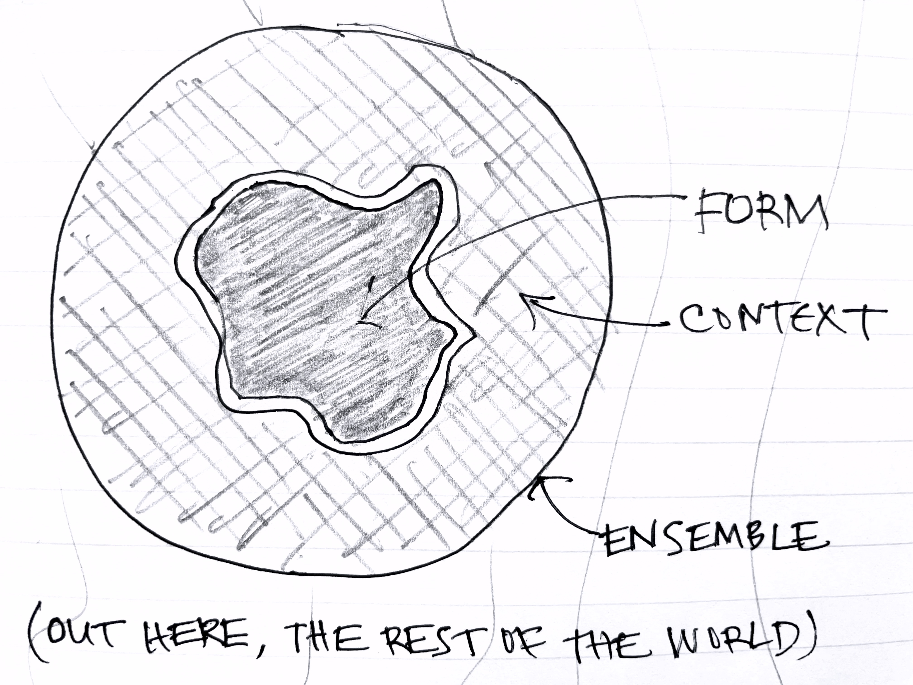

## What is a design problem?

What exactly is a design problem? And why are design problems often hard to solve?

The most compelling answer to this question, in my view, comes from Christopher Alexander in his influential book *Notes on the Synthesis of Form* (1964).

Most of the book is about a way to structure goals into a tree, by noting alignments and conflicts between them, and grouping them to minimize conflicts across groups. This idea is very similar to Herb Simon’s notion of nearly decomposable systems, which was described in his “Architecture of Complexity” paper (1962) two years before.

## Form, context, ensemble and fit

For me, however, the most interesting and valuable part of the book is the framework laid out at the very beginning on the essence of the design problem.

Design, Alexander explains, is the creation of a **form** within a **context**. Together these make an **ensemble**. The designer’s task is to ensure that the form **fits** the context within the bounds of the ensemble as a whole. A cork, for example, is a form that has to fit in the context of a wine bottle; together the cork and bottle make an ensemble. 

## A rich framing

This framing is richer and more subtle than it first appears to be:

1. **Choice of ensemble**. Factors beyond the ensemble are not considered, so the choice of the ensemble places implicit bounds on the fitness criterion. If the ensemble for the cork design is expanded to include the wine cellar, the designer might need to consider the propensity of the cork to rot or dry out in different conditions. If expanded even further to include the trees from which the material of the cork is harvested, ecological considerations may arise, and suggest a different material.
2. **Choice of boundary between context and form**. Even if the ensemble is fixed, the boundary between form and context is not. Suppose the ensemble for the cork design comprises the wine and its containers, the producers and the consumers, and fitness includes not only maintaining the freshness of the wine but also cost. In this case, a designer might propose switching from glass bottles to aluminum cans, identifying the context not as the glass bottle into which the cork is inserted but as the conditions of production, transportation and usage of the container.
3. **Simple fitness criteria**. In simple cases, fitness can be reduced to simple criteria. Alexander gives an example of a metal face fitting against the surface of a standard steel block, which is (for all practical purposes) perfectly smooth. In this case, fitness amounts simply to whether or not the surface of the face is level enough; it can be tested by inking it and noting marks on the high spots; and it can judged without testing in context by specifying the permitted variance and measuring it. This kind of situation is more common in [engineering](../design-vs-engineering) than in the design of artifacts for human use.
4. **Unknowable fitness criteria**. In more complicated cases, the criteria for fitness are so numerous that they cannot even be articulated. Worse, some criteria cannot even be predicted. The ring/silent switch on the iPhone X turned out for many users (including me) to be a hair puller. For some reason, the gap between the switch and the bezel traps hairs which then get yanked out when the phone is moved away from your head. Needless to say, users were [not delighted](https://discussions.apple.com/thread/8195963) by this feature and Apple [reportedly](https://bgr.com/tech/iphone-x-hair-pulling-issue-replacement/) was willing to replace their phones. If one were writing a list of requirements for a ring/silent switch, it seems unlikely that “don’t pull hair out” would be included.

## Misfits

The implications for software design, and design more generally, are far reaching:

1. **Completeness in requirements**. The idea that requirements should be “complete” is rendered absurd, since the list of fitness criteria is infinite and unknowable. 
2. **Misfits**. The best we can do, Alexander asserts, is identify the most likely *misfits*: ways in which form and context and likely to not fit together. In designing a file system, for example, we might identify files getting accidentally deleted as a critical misfit: this is what motivates the Trash concept (and indicts the design of the [Unix command line](https://web.mit.edu/~simsong/www/ugh.pdf)\*). Being concrete, negative scenarios, misfits are explicit and tangible, so they’re easy to explain and understand.
3. **Experiment**. The only completely reliable way to identify misfits is to try the form in the context and see what happens. In practice, however, misfits may take time to emerge, and may have already caused unacceptable damage before they are detected. Prototyping lets you test your design with lower risk and lower cost, but the context of the prototype may not match the real context well enough to catch even serious misfits (especially those with rare but disastrous consequences).
4. **Experience**. Most misfits are identified not through experiments but from experience. If you’re designing an app for selling event tickets, for example, you would [mitigate](https://www.netacea.com/glossary/ticket-scalping/) the risk of scalping; if you’re designing a backup utility, you’d want to defend against [ransomware attacks](https://ransomware.org/how-to-prevent-ransomware/passive-defense/ransomware-backup-strategy/#ransomware-resistant-backups). Neither of these misfits is predictable in the abstract, but failing to consider them, given all the experience we have building such systems, would be unforgivable.
5. **Patterns**. Where does such knowledge come from if the designer lacks the right experience? This is what patterns offer: a way to record our accumulated experience about particular design problems and their solutions. Patterns not only codify designs that have worked well in practice. They can also highlight common misfits and their mitigations. In a catalog of concept patterns, the entry for [Upvote](https://essenceofsoftware.com/posts/upvote/) would mention the problem of duplicate votes, and ways to prevent them (such as using cookies or IP addresses).

\* Just consider what happens if instead of typing _rm  \*.o_ you fail to hold down the shift key and type _rm \*>o_ instead.

